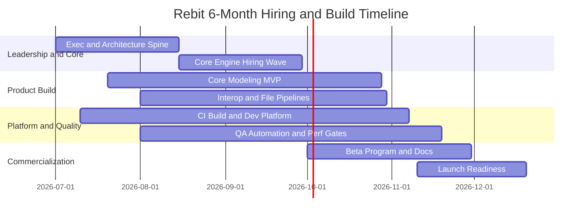
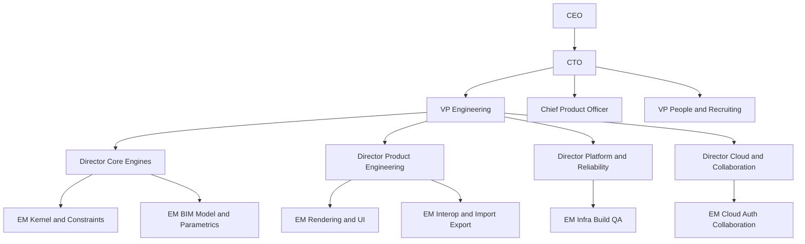
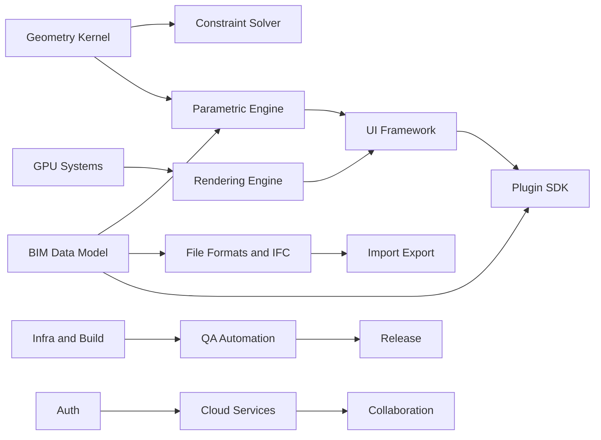

# Rebit Recruitment and Organization Master Plan (6-Month Commercial Release)

## Executive Summary

This report defines a full hiring, organization, interview, and execution system to ship a **commercial v1 BIM/CAD platform in 6 months**.

### Hard Truth Up Front

Shipping a full Autodesk Revit replacement in 6 months is not realistic. Shipping a **commercially sellable v1 for a focused scope** is realistic with strong execution, clear boundaries, and an elite team.

### Recommended Product Scope for 6 Months

Commercial v1 should target:

1. Core architectural modeling for one discipline (architecture first).
2. Native desktop app on one primary OS first (Windows), macOS close behind.
3. Parametric families (limited but robust), constraints, and schedules.
4. IFC-centric interoperability, plus selected DWG import pathways.
5. Cloud collaboration as “versioned model sharing + comments,” not full real-time multiplayer editing.
6. Plugin SDK as beta for read/query + selected write operations.

### Target Headcount at Month 6

- Total employees: **122**
- Engineering + QA + DevOps + Security technical: **90**
- Product/Design/Docs/DevRel/GTM/Corporate: **32**

### Cost Summary (USD)

- Annualized payroll at Month 6 run-rate: **$32.4M**
- 6-month cash payroll burn (ramped hiring): **$13.9M**
- Recruiting cost (fees, tooling, employer brand, relocation): **$2.8M**
- Total 6-month people program budget: **$16.7M**

### Probability of Success (Commercial v1 in 6 Months)

- If scope is constrained as above and key hires land by end of Month 2: **58% to 68%**
- If scope expands toward multi-discipline parity with incumbents: **<20%**

### Top Priorities

1. Hire spine roles first: Rust geometry, constraints, rendering/GPU, desktop architecture, and technical program leadership.
2. Freeze v1 scope by end of Week 3 and use an architecture decision record system from Day 1.
3. Build internal developer platform and QA automation in parallel, not after feature work.
4. Create a recruiting engine optimized for rare talent pools (computational geometry, kernel, CAD interoperability).

---

## Assumptions

1. Funding is sufficient to pay top quartile global compensation.
2. AI coding assistants are enabled for all engineers with secure policies.
3. No dependency on acquiring proprietary geometry kernels.
4. Initial commercial target is design firms that accept early-adopter constraints.
5. Regulated market requirements are phased in after v1.
6. Team starts from near-zero and must hire rapidly.

---

## Part 1: Department Headcount and Why Each Function Is Required

| Department | Month 6 Headcount | Why Needed |
|---|---:|---|
| Engineering (core dev) | 72 | Build kernel, BIM model, parametrics, renderer, app, cloud, SDK, perf. |
| QA / Test Engineering | 10 | Prevent regressions in geometry and modeling flows; release confidence. |
| DevOps / SRE / Platform | 6 | CI/CD speed, build reliability, cloud environments, observability. |
| Security (AppSec + CloudSec) | 2 | Secure plugin model, auth, data handling, supply chain controls. |
| Product Management | 8 | Scope control, customer validation, cross-team prioritization. |
| Design (UX + visual + research) | 6 | Complex modeling UX, productivity workflows, onboarding. |
| Technical Writing | 3 | User docs, API docs, release notes, admin docs. |
| Developer Relations | 2 | SDK adoption, ecosystem growth, technical content. |
| HR / People Ops | 3 | Onboarding, performance systems, retention and compliance. |
| Recruiting | 5 | High-volume sourcing for niche talent in compressed timeline. |
| Finance | 2 | Budget control, hiring plans, compensation governance. |
| Operations / IT | 3 | Device provisioning, office/remote ops, access management. |
| **Total** | **122** | Minimum scale for 6-month commercial v1 with acceptable quality. |

---

## Part 2: Engineering Team Design

### Engineering Organization Overview

| Team | Size | Priority | Core Responsibility | Key Dependencies |
|---|---:|---|---|---|
| Geometry Kernel | 8 | P0 | B-Rep, topology, booleans, intersections | Performance, file formats |
| BIM Data Model | 7 | P0 | Entity graph, relationships, metadata | Parametric engine, IFC |
| Parametric Engine | 6 | P0 | Parameters, formulas, update propagation | BIM model, constraint solver |
| Constraint Solver | 5 | P0 | Geometric + dimensional constraints | Geometry, parametrics |
| Rendering Engine | 6 | P0 | Scene graph, draw pipeline, selection render paths | GPU team |
| GPU Systems | 5 | P0 | Vulkan/Metal abstraction, shader framework, perf | Rendering engine |
| UI Framework | 5 | P0 | Command architecture, dockable panels, tool states | Desktop platform |
| Desktop Platform | 5 | P0 | Native shell, persistence, files, update system | UI framework |
| File Formats & Interop | 6 | P0 | IFC read/write first, DWG pathway, translators | BIM model |
| Import/Export Pipeline | 4 | P1 | Job orchestration, conversion pipeline, error diagnostics | Interop |
| Cloud Services | 5 | P1 | Project service, model versioning, API | Auth, collaboration |
| Collaboration | 4 | P1 | Comments, review states, shared workspaces | Cloud services |
| Authentication & Identity | 3 | P1 | SSO/OIDC, RBAC, tenancy | Cloud services, security |
| Plugin SDK | 4 | P1 | Stable API surface, sandbox, SDK tooling | Desktop, BIM model |
| AI Features | 4 | P1 | Prompted commands, rule checks, natural language queries | SDK + BIM model |
| Performance & Reliability | 4 | P0 | Profiling, benchmarks, startup and interaction latency | All teams |
| Infrastructure & CI | 4 | P0 | Build farm, artifact pipeline, release gates | Build systems |
| Internal Developer Platform | 3 | P0 | Dev environments, templates, golden paths | Infra |
| Build Systems | 3 | P0 | Monorepo strategy, deterministic builds, cache | Infra, desktop |
| QA Automation | 5 | P0 | End-to-end test rigs, geometry test oracle, perf CI | All product teams |
| **Total Core Engineering** | **102 team slots** |  | Includes shared specialists and leadership overlays |

Note: 102 team slots includes team leads and shared experts. Distinct headcount in Part 1 is lower because some leaders cover multiple domains and late-phase hiring defers non-critical seats.

### Team Charters (Condensed)

#### Geometry Kernel Team
- Responsibilities: solid ops, topology integrity, geometric predicates, tolerance management.
- Required expertise: computational geometry, robust numerical methods, Rust unsafe correctness.
- Recommended team size: 8.
- Hiring priority: immediate (Week 1).
- Critical risks: robustness bugs create cascading failures.
- Dependencies: performance/reliability, file formats.

#### BIM Data Model Team
- Responsibilities: object schema, dependency graph, transactions, change tracking.
- Expertise: graph data structures, model serialization, CAD/BIM schema mapping.
- Size: 7, Priority: immediate.
- Risks: schema churn and migration complexity.
- Dependencies: parametric engine, IFC.

#### Parametric Engine Team
- Responsibilities: parameter evaluation, formulas, incremental recompute.
- Expertise: dependency graphs, incremental compilers, deterministic execution.
- Size: 6, Priority: immediate.
- Risks: non-determinism and cyclic dependencies.
- Dependencies: BIM model, constraints.

#### Constraint Solver Team
- Responsibilities: solve dimensional/geometric constraints with predictable behavior.
- Expertise: numerical optimization, nonlinear solvers, CAD sketch constraints.
- Size: 5, Priority: immediate.
- Risks: unstable solve loops, poor UX feedback.
- Dependencies: geometry + parametric teams.

#### Rendering + GPU Teams
- Responsibilities: viewport fidelity, interaction framerate, selection/overlay passes.
- Expertise: Vulkan/Metal, shader optimization, memory bandwidth profiling.
- Size: 11 combined, Priority: immediate.
- Risks: platform-specific regressions and driver variability.
- Dependencies: desktop platform, performance.

#### UI Framework + Desktop Platform Teams
- Responsibilities: command stack, snapping UX, host integration, crash recovery.
- Expertise: native desktop architecture, event systems, productivity UX.
- Size: 10 combined, Priority: immediate.
- Risks: UX inconsistency and stability issues.
- Dependencies: all feature teams.

#### Interop Teams (IFC/DWG/Import Export)
- Responsibilities: robust conversion, diagnostics, data fidelity checks.
- Expertise: IFC standards, DWG ecosystem, mapping pipelines.
- Size: 10 combined, Priority: Month 1 start.
- Risks: legal/IP concerns around DWG, quality of round trips.
- Dependencies: BIM model.

#### Cloud + Collaboration + Auth Teams
- Responsibilities: accounts, projects, model versions, async collaboration.
- Expertise: distributed systems, tenancy, RBAC, API design.
- Size: 12 combined, Priority: Month 2.
- Risks: overbuilding real-time systems too early.
- Dependencies: security, infra.

#### Plugin SDK + AI Features Teams
- Responsibilities: extension API, API governance, AI workflow primitives.
- Expertise: API lifecycle, sandboxing, model context tooling.
- Size: 8 combined, Priority: Month 3.
- Risks: unstable APIs and support burden.
- Dependencies: desktop, BIM model, security.

#### Platform Teams (Performance, Infra, IDP, Build, QA Automation)
- Responsibilities: keep velocity and quality scaling with team size.
- Expertise: CI, test infra, benchmarks, observability, release engineering.
- Size: 19 combined, Priority: immediate for first 10 hires.
- Risks: release failure without gates.
- Dependencies: all teams.

---

## Part 3: Role Library (Mission, Skills, Process, Signals)

Comp ranges are annual USD cash + equity target for strong private-market candidates.

| Job Title | Mission | Seniority | Compensation (USD) | Hiring Regions |
|---|---|---|---:|---|
| Principal Geometry Engineer | Own robust geometric kernel primitives | Principal | 320k to 520k | US, Canada, Germany, France, Poland |
| Senior Rust Systems Engineer | Build high-performance core services and desktop modules | Senior | 220k to 360k | US, Canada, UK, Poland, Portugal |
| Principal Constraint Solver Engineer | Build stable and fast solver stack | Principal | 330k to 540k | US, EU hubs, Japan |
| Staff Rendering Engineer | Architect viewport/rendering pipeline | Staff | 280k to 450k | US, Canada, Finland, Sweden |
| Senior GPU Engineer | Optimize shaders and GPU memory patterns | Senior | 240k to 390k | US, Canada, Taiwan, South Korea |
| Staff BIM Data Model Engineer | Define schema and model lifecycle | Staff | 260k to 430k | US, UK, Germany, Netherlands |
| Senior IFC Interop Engineer | Deliver high-fidelity IFC read/write | Senior | 210k to 340k | Germany, UK, Nordics, US |
| Senior Desktop Engineer | Build native app shell and core workflows | Senior | 210k to 340k | US, Canada, Poland, Spain |
| Staff Developer Platform Engineer | Create golden paths for engineering velocity | Staff | 240k to 390k | US, UK, India, Poland |
| QA Automation Architect | Build model-level and workflow test automation | Staff | 220k to 350k | US, India, Poland, Romania |
| Product Manager, Core Modeling | Own v1 workflow outcomes and scope | Senior | 220k to 360k | US, UK, Germany |
| Product Designer, Pro Tools | Design expert productivity UX | Senior | 180k to 290k | US, UK, Nordics |
| Security Engineer (AppSec) | Secure plugin/runtime and supply chain | Senior | 220k to 350k | US, Israel, UK |
| DevRel Engineer, SDK | Grow plugin ecosystem and documentation | Senior | 170k to 290k | US, Europe |

### Standard Role Profile Template (Apply to Every Role Above)

1. Mission: one measurable business outcome tied to 6-month v1.
2. Responsibilities: 5 to 8 concrete deliverables with deadlines.
3. Required experience: domain depth, shipped systems, scale and ownership.
4. Must-have skills: Rust plus domain stack (geometry/GPU/cloud/etc).
5. Nice-to-have skills: BIM/CAD background, open source leadership.
6. Interview process: recruiter screen, technical deep dive, work sample, values, exec close.
7. Exceptional candidate signals:
   - Can explain tradeoffs with failure stories and recovery.
   - Demonstrates production-quality rigor, not just algorithm knowledge.
   - Writes concise design docs and challenges unclear scope.
8. Red flags:
   - Overfocus on frameworks over system fundamentals.
   - Cannot reason about numerical stability or deterministic behavior.
   - Blames prior teams without evidence of ownership.

---

## Part 4: 6-Month Hiring Roadmap

### Hiring Logic

- Month 1 to 2: hire architectural spine and execution leaders.
- Month 3 to 4: add feature throughput teams.
- Month 5 to 6: fill quality, docs, ecosystem, and support scale.

### Month-by-Month Hiring Plan

| Month | Net New Hires | Focus Roles | Why |
|---|---:|---|---|
| Month 1 | 24 | VP Eng, Directors, Principal Kernel/Constraint/Rendering, PM core, Recruiters, Build/Infra leads | Foundation and decision velocity |
| Month 2 | 20 | Senior ICs in kernel/BIM/parametrics/UI/desktop, QA automation lead, AppSec lead | Turn architecture into shipping code |
| Month 3 | 22 | Interop, cloud, auth, collaboration, design, technical writing | Complete end-to-end workflows |
| Month 4 | 20 | Plugin SDK, AI features, perf, SRE, additional QA | Stabilize product and SDK surface |
| Month 5 | 18 | DevRel, docs, support engineers, PMM/GTM adjacent hires | Commercial readiness |
| Month 6 | 18 | Remaining ICs, release engineering, customer success technical specialists | Launch and post-launch support |
| **Total** | **122** |  |  |

### Gantt-Style Timeline

---

## Part 5: Organizational Hierarchy and Reporting

Reporting standard:

1. Each Engineering Manager has 6 to 8 direct reports.
2. Tech Leads are hands-on and own technical direction for one problem area.
3. Directors own cross-team roadmap, staffing, and architecture quality.

---

## Part 6: Top 20 Hardest Roles to Hire

| Rank | Role | Why Hard | Likely Talent Sources |
|---:|---|---|---|
| 1 | Principal Geometry Kernel Engineer | Very small global pool with production CAD robustness experience | Autodesk, Dassault, Siemens, OpenCascade |
| 2 | Principal Constraint Solver Engineer | Rare blend of math rigor and product pragmatism | PTC, Siemens, CAD startups |
| 3 | Staff IFC Interoperability Architect | Deep standards expertise plus practical implementation scars | Bentley, Trimble, buildingSMART contributors |
| 4 | Staff GPU Rendering Architect | Real-time + precision + desktop constraints | NVIDIA, Apple, Unity, Epic |
| 5 | Director Core Engines | Must lead domain experts while delivering fast | Autodesk, Dassault, Hexagon |
| 6 | Principal Rust Systems Engineer (CAD) | Rust + CAD overlap is very rare | Rust OSS maintainers, high-perf startups |
| 7 | Staff BIM Data Architect | Schema and workflow depth required | Autodesk, Bentley, Nemetschek |
| 8 | Staff Import/Export Architect | Must handle messy real-world files | Interop vendors, CAD toolchains |
| 9 | Staff Build and Toolchain Engineer | Cross-platform Rust/C++ and fast CI at scale | Mozilla alumni, game engines |
| 10 | QA Architect for Geometry | Requires test oracle design for non-trivial geometry | CAD vendors, simulation firms |
| 11 | Desktop Platform Architect | Native app expertise and productivity tooling | Apple, Microsoft, JetBrains |
| 12 | Staff Performance Engineer | Must optimize CPU/GPU/memory across subsystems | Game engines, browser engines |
| 13 | Security Engineer for Plugin Sandbox | AppSec + extensibility security niche | Browser/runtime security teams |
| 14 | SDK Platform Architect | API governance and backwards compatibility rigor | Stripe, Twilio, Autodesk APIs |
| 15 | PM, Core Modeling | Needs deep design-tool empathy and ruthless scope skills | Autodesk, Figma, Adobe |
| 16 | Design Lead, Pro Workflows | Expert UX for dense desktop workflows | CAD/EDA/pro creative tools |
| 17 | DevRel Lead, Technical SDK | Needs credibility with advanced plugin devs | Developer platform companies |
| 18 | Cloud Collaboration Architect | Balance simple v1 with future real-time architecture | Atlassian, Figma, Notion |
| 19 | Recruiting Lead for Niche Technical Hiring | Must run high-touch search in scarce markets | Top technical search firms |
| 20 | Technical Writer for APIs + BIM workflows | Rare dual literacy in docs and domain | CAD API doc specialists |

---

## Part 7: Global Recruitment Strategy

### Priority Countries

- United States, Canada, UK, Germany, France, Netherlands, Poland, Portugal, Finland, Sweden, Israel, India, Japan, Taiwan.

### University Targets

- MIT, Stanford, CMU, ETH Zurich, TU Munich, Imperial, Cambridge, Oxford, University of Waterloo, UIUC, Georgia Tech, EPFL, IIT Bombay, IIT Madras, Tokyo University.

### Conferences and Communities

- SIGGRAPH, GDC rendering tracks, RustConf, EuroRust, CppCon systems tracks, buildingSMART summits, Autodesk University, GPU Technology Conference.

### Open Source and GitHub Signals

- OpenCascade ecosystem, Blender geometry modules, Rust graphics ecosystem, IFC tooling projects, computational geometry libraries.

### LinkedIn and Executive Search Strategy

1. Build a named target list of 350 high-priority candidates in 3 weeks.
2. CTO and VP Eng do direct outreach to top 50 candidates.
3. Use retained search for top 15 critical hires only.
4. Publish architecture blog series to attract passive talent.

### Referral Engine

1. Double referral bonus for hard-role families.
2. 72-hour feedback SLA for referred candidates.
3. Monthly referral leaderboard with public recognition.

---

## Part 8: Recruiting Pipeline Model

Assume conversion funnel for niche engineering:

- Applications/Outbound touches to recruiter screen: 18%
- Recruiter screen to technical stage: 40%
- Technical to final: 35%
- Final to offer: 45%
- Offer acceptance: 68% average (higher for mission-critical roles with executive close)

| Role Family | Hires | Top-of-Funnel Needed | Recruiter Screens | Technical Interviews | Final Interviews | Offers | Accept Rate | Avg Time to Fill |
|---|---:|---:|---:|---:|---:|---:|---:|---|
| Core engine principals/staff | 14 | 1,150 | 207 | 83 | 29 | 13 | 65% | 70 to 110 days |
| Senior product engineers | 30 | 1,000 | 180 | 72 | 25 | 17 | 70% | 45 to 75 days |
| Interop and file specialists | 10 | 520 | 94 | 38 | 13 | 8 | 68% | 60 to 95 days |
| Platform/infra/QA | 20 | 760 | 137 | 55 | 19 | 14 | 72% | 40 to 70 days |
| Product/design/docs/devrel | 19 | 570 | 103 | 41 | 14 | 11 | 73% | 35 to 60 days |
| Leadership (VP/Director/EM) | 8 | 290 | 52 | 21 | 7 | 5 | 62% | 75 to 120 days |

---

## Part 9: Complete Interview System

### Interview Architecture by Track

1. Recruiter screen (30 min): motivation, compensation alignment, timeline.
2. Domain screen (60 min): real technical depth in role area.
3. Work sample (2 to 4 hours): role-specific challenge.
4. Panel interview (3 rounds): architecture, collaboration, delivery.
5. Executive close (30 to 45 min): mission alignment and ownership expectations.

### Domain Modules

- Coding: Rust correctness, algorithmic reasoning, code quality.
- Architecture: system decomposition and dependency risk handling.
- Geometry algorithms: robustness, epsilon strategy, edge cases.
- GPU programming: pipeline decisions, memory layouts, profiling strategy.
- Rust ownership/lifetimes: practical correctness under pressure.
- Concurrency: lock-free/actor patterns, determinism tradeoffs.
- Performance optimization: baseline, hypothesis, profile, iterate loop.
- Leadership and communication: alignment, conflict handling, mentoring.

### Scoring Rubric

| Dimension | 1 (Weak) | 3 (Good) | 5 (Exceptional) |
|---|---|---|---|
| Technical depth | Superficial answers | Solid implementation experience | Demonstrates deep first-principles reasoning |
| Execution | Talks in abstractions | Clear shipping examples | Repeatedly delivered under constraints |
| Quality mindset | Ignores testing and reliability | Understands basics | Builds quality systems proactively |
| Collaboration | Blame language | Functional collaborator | Raises team performance materially |
| Product judgment | Feature-only thinking | Balances tradeoffs | Ruthlessly aligns to customer value and scope |

Hiring bar rule: no candidate proceeds with any panel score below 3 in critical dimensions.

---

## Part 10: Organizational Risk Matrix and Mitigations

| Risk | Likelihood | Impact | Early Signal | Mitigation |
|---|---|---|---|---|
| Communication overhead | High | High | Long decision cycles | Weekly architecture council + DRI ownership |
| Knowledge silos | High | High | Single points of failure | Pair design reviews, rotation plans, docs gates |
| Architecture drift | Medium | High | Divergent patterns across teams | ADR process + principal engineer review |
| Hiring bottlenecks | High | High | Time-to-fill exceeds 75 days | Dedicated sourcers + exec outreach cadences |
| Burnout | Medium | High | Sustained overtime, quality drop | Explicit no-crunch policy + capacity buffers |
| Dependency risks | High | High | Blocked PRs, cross-team wait states | Dependency board + integration milestones |
| Scope creep | Very High | Very High | Growing backlog with vague priorities | Scope freeze and change control board |
| Decision paralysis | Medium | High | Repeated reopened decisions | DRI model with 48-hour decision SLA |

---

## Part 11: Recommended Engineering Toolchain

| Category | Recommendation | Why |
|---|---|---|
| Version control | GitHub Enterprise monorepo with CODEOWNERS | Consistent governance and ownership |
| CI/CD | GitHub Actions + self-hosted runners + Buildkite for heavy jobs | Flexible scale and faster build pipelines |
| Issue tracking | Jira (delivery) + Productboard (discovery) | Clear planning and stakeholder alignment |
| Documentation | Notion for process + MkDocs/Docusaurus for product docs | Fast internal and external docs workflows |
| Design reviews | Figma + formal design review checklist | UX consistency for complex workflows |
| ADRs | Markdown ADRs in repo with template and approval flow | Architectural traceability |
| Testing | Unit + property + golden model + E2E desktop automation | Robustness for geometry-heavy systems |
| Benchmarking | Criterion (Rust) + custom scenario benchmark suite | Performance regression control |
| Profiling | Tracy, Instruments, RenderDoc, Perfetto | CPU/GPU bottleneck visibility |
| Crash reporting | Sentry + symbol server integration | Faster triage and reliability |
| Observability | OpenTelemetry + Grafana + Loki | End-to-end cloud and service visibility |
| Security scanning | CodeQL, Dependabot, SAST/DAST, SBOM tooling | Supply-chain and code risk reduction |
| Dev productivity | Dev containers, one-command bootstrap, AI assistant governance | Onboarding speed and consistency |

---

## Part 12: Budget, Milestones, and Decision Rationale

### Payroll and Hiring Budget Estimate

| Segment | Headcount | Avg Loaded Annual Cost | Annualized Cost |
|---|---:|---:|---:|
| Engineering core | 72 | 310,000 | 22.32M |
| QA/DevOps/Security | 18 | 260,000 | 4.68M |
| Product and Design | 14 | 245,000 | 3.43M |
| Docs/DevRel | 5 | 205,000 | 1.03M |
| HR/Recruiting/Finance/Ops | 13 | 170,000 | 2.21M |
| **Total Annualized** | **122** |  | **33.67M** |

Adjusted run-rate with hiring ramp and mixed geo distribution: **~32.4M annualized**, **~13.9M payroll over first 6 months**.

### Critical Milestones

1. Week 3: v1 scope freeze and architecture baseline approved.
2. Week 6: kernel + BIM + parametric backbone demo.
3. Week 10: desktop modeling workflow alpha end-to-end.
4. Week 14: IFC import/export quality threshold reached.
5. Week 18: beta with design partners and telemetry.
6. Week 24: commercial launch with support runbook.

### Team Dependency Diagram

### Priority Ranking

1. Core geometry/constraints/parametrics correctness.
2. Desktop workflow usability and stability.
3. Interoperability (IFC first).
4. Release quality gates and performance baselines.
5. SDK beta and AI workflow assistance.
6. Broader cloud collaboration depth (post-v1 expansion).

### Top Recommendations

1. Treat 6 months as a high-discipline program, not a feature race.
2. Lock scope early and reject requests not tied to launch metrics.
3. Over-invest in hiring quality for the first 35 engineers.
4. Build quality/performance infrastructure in parallel from Week 1.
5. Start with one-discipline, one-platform excellence; then expand.

### Final Success View

The plan is aggressive but viable if leadership enforces scope control, technical quality gates, and fast hiring decisions. The biggest determinant of success is not budget; it is disciplined prioritization and landing rare senior technical talent in the first 8 weeks.
